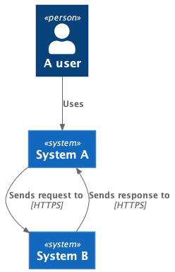
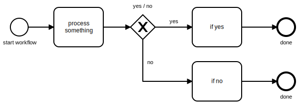

# Diagrams as code

Examples of embedding various diagrams into an Asciidoctor document.

GitHub repository: https://github.com/gratiartis/diagrams-as-code

## Examples

The following are some examples of diagrams that have been generated by this project, from simple text formats.

### C4



### BPMN




## Building the project

To see examples of building this, the GitHub repository has [Actions](https://github.com/gratiartis/diagrams-as-code/actions) configured in [.github/workflows/build.yml](https://github.com/gratiartis/diagrams-as-code/blob/main/.github/workflows/build.yml). Look in the page for the most recent build to find the latest generated PDF: `example-doc.pdf`.


### Simple build with a Docker container

If you have Docker Compose installed, and don't want to mess around with installing anything yourself, the following is a quick and easy way to build this PDF.

```
docker-compose run --rm builder ./build-pdf.sh
```

Take a look in `Dockerfile` to see the tools which are installed. It's based on the official [asciidoctor/docker-asciidoctor](https://hub.docker.com/r/asciidoctor/docker-asciidoctor) image, which already includes tools such as Asciidoctor PDF and Asciidoctor Diagram.


### Pre-requisites

First install [Graphviz](https://graphviz.gitlab.io/about/).
```
# Windows:
choco install graphviz
# Mac:
brew install graphviz
```

Then the NPM packages defined in package.json.
```
npm install
```

If you don't have them installed already, asciidoctor and asciidoctor-pdf can be installed as Gems here:
```
bundle
```

To create a bin stub (a shortcut to bypass using `bundle exec`) for asciidoctor, you may also need to run:

```
bundle binstubs asciidoctor
```


### Build

The example shell scripts provided show how to use the tooling:

* `./scripts/build-pdf.sh` will build a PDF.
* `./scripts/build-html.sh` will build an HTML website.


## Asciidoctor

This project makes use of Asciidoctor to generate rich documentation. [Asciidoctor markdown syntax](https://docs.asciidoctor.org/asciidoc/latest/syntax-quick-reference/) is particularly good for generating nicely formatted HTML and PDF output.

If you install Ruby, a Gemfile is provided here, which installs both Asciidoctor and Aciidoctor Diagram, in which case you can run.


## BPMN diagrams

There are a number of diagrams in the project, using BPMN. You can edit these files using the free [BPMN.IO](https://demo.bpmn.io/) editor, or one of a number of other tools such as [Camunda](https://camunda.com/), [Visual Paradigm](https://online.visual-paradigm.com/diagrams/features/bpmn-tool/), or [Eclipse](https://www.eclipse.org/bpmn2-modeler/).

These use [asciidoctor-diagram](https://asciidoctor.org/docs/asciidoctor-diagram/) to generate the images for embedding in the final document. See the contents of `build.sh` for an example of using this.
